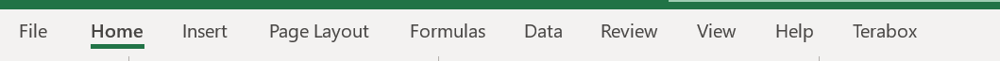
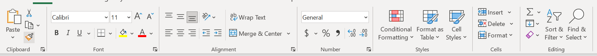
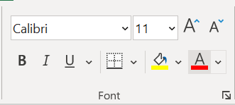
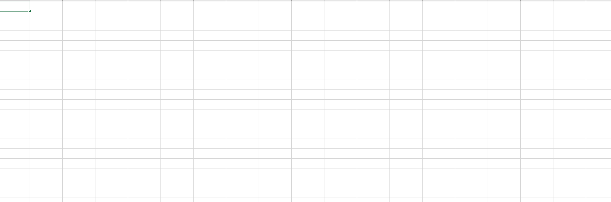
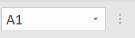
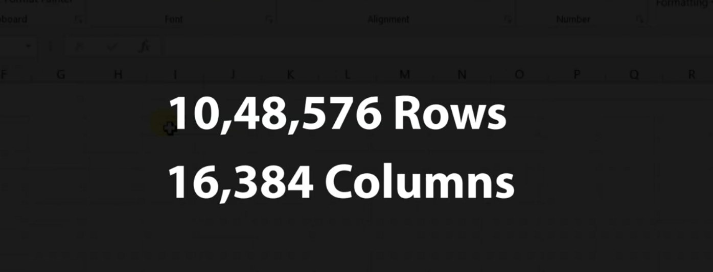
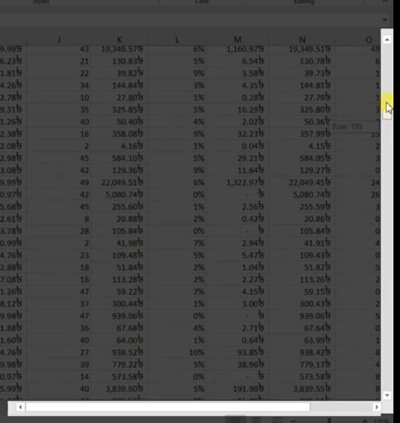

# Excel Documentation

- Excel REBBON

  

- Excel TAB

  

- Excel TOOLBAR

  

- Excel TOOL-GROUP

  

- Excel quick-access-bar

  

  - For add tool into quick access bar section **[right-click on the tool -> add to quick access toolbar]**

    _Example_
    

- Excel Worksheet

  

- Excel formula bar

  

- Excel name bar

  

- Excel Number of rows and columns

  

## Data navigation

- Excel horizontal and vertical move ment key for movement

  

- Move top row of the excel worksheet

  ```
  ctrl + (Home / ?) key

  ```
